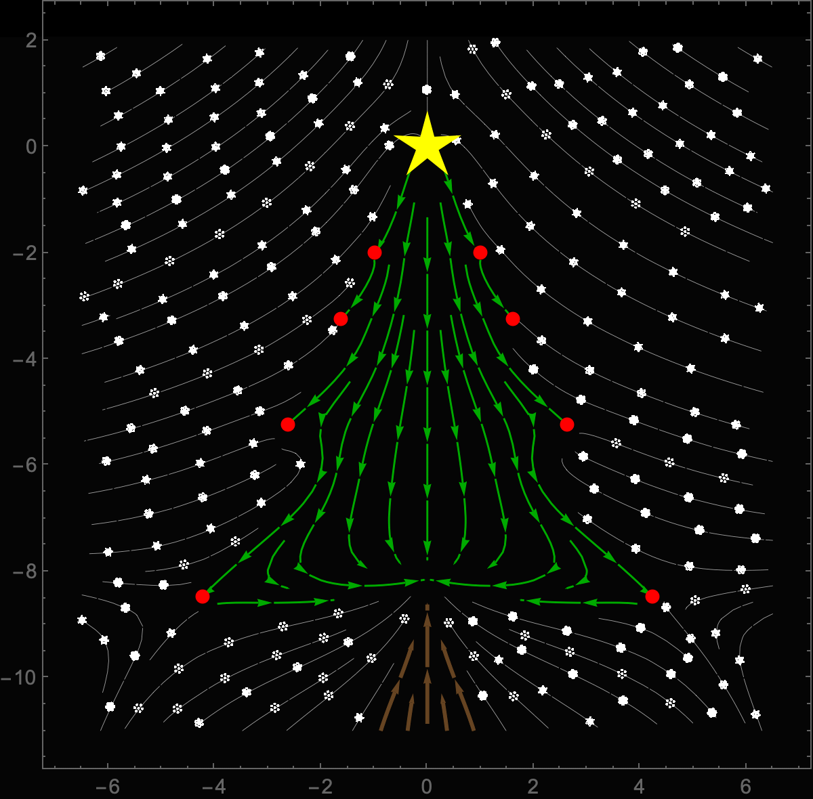

# Advent of Code 2025

Author: José Ramón Morera Campos  
Language: Python

I try to solve daily, post each day the solutions of previous day.

## Naming
`dayXX-1.py` = Part 1 of day XX  
`dayXX-2.py` = Part 2 of day XX
  
Sometimes I may improve a previous solution, those are the files called `dayXX-XB.py`

